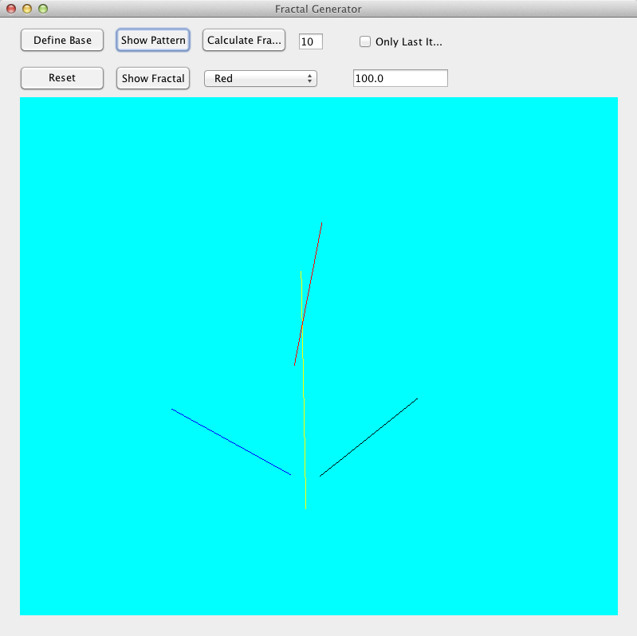
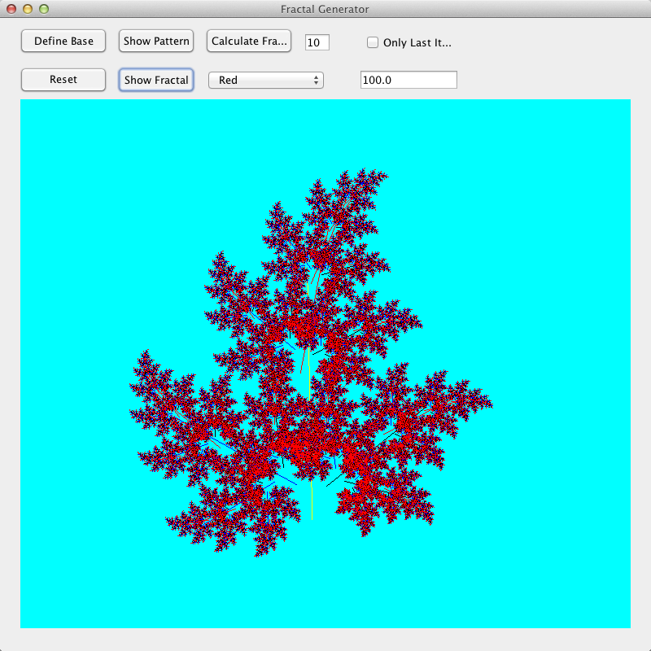

# Fractal Generator

This project consists of:
- An abstract framework (which expects concrete transformations implementations) to compute fractals from a user specified geometric pattern.
- An implementation of shape transformations for the simplest of all shapes: lines!
- An abstract framework to update progress of an abstract task (i.e. fractal generator) using abstract workers.
- Two implementations of the update progress workers: polling (asynchronous) and threshold reached (synchronous).
- A Java Swing client application to provide a user interface to all this.

### Usage & Design

The generator framework requires concrete implementations of the shapes is going to be using with their respective transformation logic:

```java

	public interface GeometricPattern<SHAPE_TYPE> {
		public void computeConstants(SHAPE_TYPE base);
		public SHAPE_TYPE computeGeometryEquivalentTo(SHAPE_TYPE relativeBase);
	}

```


Having this interface implemented, the framework will generate the fractal using the following logic:
- The first shape of a pattern set is a **base**
- The rest of the shapes are relative transformations to be applied to said **base**.
- The generator recursively applies the same transformations to each of the other shapes.
- Cut off arguments are available to catalyze the process. The level of depth of the recursion can be control with the nuber of iterations argument and if we want only the last level of recursion, the boolean argument **onlyLastIteration** need to be set as true.

``` java

	// Generator constructor
	public GeometricPatternFractalGenerator(
		SHAPE_TYPE base,					// base shape
		List<SHAPE_TYPE> patterns,			// rel transformations to be applied to base
		int numIter,						// recursion depth
		boolean lastIterOnly,				// only gather shapes computed @ last recursion level
		Consumer<Float> progressListener	// progress listener
	){  ...  }

```


The generator computes the fractal asynchrously, updating periodically its progress through the **progressWriter** listener:

```java

	Consumer<Float> progressWriter = this::listenProgress;

	...

	public void listenProgress(float percentProgress)  {
		if (progress == IProgressUpdater.FINISHED_PROGRESS) {
			// The fractal generator has finished computing the fractal
		} else {
			// Update progress status if desired
		}
	}

```


To access the shapes computed by the generator invoke the **getFractal()** method:

```java

    List<SHAPE_TYPE> shapesGenerated = fractalGenerator.getFractal();
    shapesGenerated.stream().forEach(shape -> draw(shape));

```
# Screenshot Samples

Input Pattern
-




Fractal Generated
-


