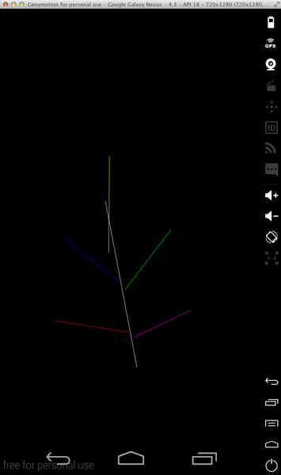

# Fractal Generator

This project consists of:
- An abstract framework (which expects concrete transformations implementations) to compute fractals from a user specified geometric pattern.
- An implementation of shape transformations for the simplest of all shapes: lines!
- An abstract framework to update progress of an abstract task (i.e. fractal generator) using abstract workers.
- Two implementations of the update progress workers: polling (asynchronous) and threshold reached (synchronous).
- An Android application using this framework to render fractals.
- A Java Swing application using this framework to render fractals.

## Getting Started

The project contains the source code of two applications in different branches.

1. An Android application in the `android` branch.
2. A Java Swing application in the `master` branch.

Both applications operate in the following way. The idea is to define a set of lines that will form a geometric pattern for the application to eventually apply self-similarity to the rest of them in order to generate the fractal.

1. Draw these pattern `lines` on your screen (patterns) through mouse clicks and/or gestures. 
2. There is an option to change `color` to define the color attribute of each of the pattern lines through their definition process.
3. Once you are satisfied with your pattern choose the option to `generate` the fractal (menu options or visible buttons) answering how many `recursions` you want to apply to the pattern and that's it! 

As a warning, it is better not to define too many lines in the pattern (5 should be fine), nor higher recursion levels
(no more than 7 for a 5 line pattern); as the recursion is memory and processing intensive and the application is prone
to crash if the fractal is too big.

### Android Application



1. Download or clone the source code from the `android` branch.
2. From within the project folder execute the command `mvn compile`. 
3. This will create in the `target` folder the **APK** file that you need to upload to your android device. This file has the form `fractals-*.apk`. 
4. Once uploaded, proceed to install it and thereafter you can start using the application.

### Swing application


1. Download or clone the source code from the `master` branch.
2. Execute from within the project folder downloaded the following maven commands:

```

	mvn compile
	mvn exec:java

```

That will launch the Swing application which is fairly intuitive to use, and which follows the same paradigm used with the android
application described in the previous section.

## Framework Usage & Design

The generator framework requires concrete implementations of the shapes is going to be using with their respective transformation logic:

```java

	public interface GeometricPattern<SHAPE_TYPE> {
		public void computeConstants(SHAPE_TYPE base);
		public SHAPE_TYPE computeGeometryEquivalentTo(SHAPE_TYPE relativeBase);
	}

```


Having this interface implemented, the framework will generate the fractal using the following logic:
- The first shape of a pattern set is a **base**
- The rest of the shapes are relative transformations to be applied to said **base**.
- The generator recursively applies the same transformations to each of the other shapes.
- Cut off arguments are available to catalyze the process. The level of depth of the recursion can be control with the nuber of iterations argument and if we want only the last level of recursion, the boolean argument **onlyLastIteration** need to be set as true.

``` java

	// Generator constructor
	public GeometricPatternFractalGenerator(
		SHAPE_TYPE base,					// base shape
		List<SHAPE_TYPE> patterns,			// rel transformations to be applied to base
		int numIter,						// recursion depth
		boolean lastIterOnly,				// only gather shapes computed @ last recursion level
		Consumer<Float> progressListener	// progress listener
	){  ...  }

```


The generator computes the fractal asynchrously, updating periodically its progress through the **progressWriter** listener:

```java

	Consumer<Float> progressWriter = this::listenProgress;

	...

	public void listenProgress(float percentProgress)  {
		if (progress == IProgressUpdater.FINISHED_PROGRESS) {
			// The fractal generator has finished computing the fractal
		} else {
			// Update progress status if desired
		}
	}

```


To access the shapes computed by the generator invoke the **getFractal()** method:

```java

    List<SHAPE_TYPE> shapesGenerated = fractalGenerator.getFractal();
    shapesGenerated.stream().forEach(shape -> draw(shape));

```
